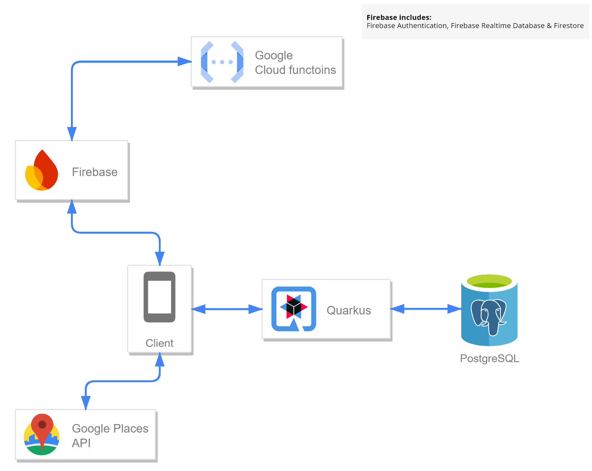

# Smart Living App

## Project Overview

The Smart_Living repository containts an Android application developed to manage and monitor smart devices within a connected living environment. Built using Kotlin and following the Clean Architecture approach, the application leverages Jetpack Compose for a modern, intuitive user interface. It integrates with Firebase for real-time data synchronization, backend management and user authentication.

The application aims to enhance energy efficiency, simplify device management and improve user comfort. Key features include location-based detection, which ensures the user is in their designated space and environmental monitoring through the use of temperature and humidity sensors. This holistic approach allows users to stay connected with their samrt devices and environment from anywhere.

## Key Features

- **Device Management:** Users can control and monitor connected smart devices, such as thermostats, air conditions and dehumidifiers directly from the app.
- **Energy Monitoring:** The app tracks energy consumption over time and provides insights into overall energy usage, helping users to optimize and reduce power consumption.
- **Location Detection:** The app uses Location Permission to detect if the user is within their own space.
- **User Authentication & Personalization:** Secure login and registration through Firebase Authentication, allowing users to manage their smart home devices and receive tailored experiences.

## Technologies Used

### Firebase

- **Firebase Authentication:** Handles user sign-in and registration securely, including options for email/password and third-party authentication.
- **Firebase Firestore:** A cloud-based NoSQL database used for storing and syncing user and device data in real time.
- **Firebase Realtime Database:** Another real-time database solution used for live data synchronization, enabling instant updates.

### Location Services

- **Google Play Services (Location):** Provides location-based services such as GPS, allowing the app to determine if the user is within their designated space.
- **Google Places API:** Allows the app to fetch detailed location data, enhancing location-based functionalities.

### Retrofit

- A type-safe HTTP client for Android used for making API requests, enabling communication between the mobile app and external services like the simulated smart devices.

### OkHttp

- A powerful HTTP client that works alongside Retrofit to log requests and responses, aiding in the debugging and tracking of network calls.

### Gson

- A library for serializing and deserializing JSON data, used in conjunction with Retrofit to handle API responses.

### Android Sensors

- **Environmental Sensors:** The app accesses the device’s built-in sensors to capture environmental data such as temperature and humidity, providing real-time monitoring for the user.

## Application Diagram

## Related Repositories

This project is part of a larger system, consisting of multiple repositories that work together to provide a complete smart energy management solution:

1. **[Smart Living Server:](https://github.com/ApostolisSiampanis/Smart_Living_Server)** This repository contains the server-side logic for managing backend operations in the Smart Living system. It integrates with Firebase services, including Firestore, Realtime Database, Firebase Authentication and implements various HTTP and scheduled functions to facilitate user data management, device power consumption monitoring and historical data handling. The server functions are designed to support real-time interactions and periodic maintenance of smart device data, enhancing system reliability and user experience.
2. **[Smart Living Hub (Quarkus):](https://github.com/ApostolisSiampanis/Smart_Living_Hub)** This repository contains a simulated hub designed for managing smart devices and handling API requests. It is built using the Quarkus framework, which provides a lightweight, reactive and cloud-native platform for developing Java applications. The hub interfaces with a PostgreSQL database to store device data and logs, effectively acting as a bridge between smart devices and the Android application.

## License

This project is licensed under the MIT License - see the [LICENSE](./LICENSE) file for details.
